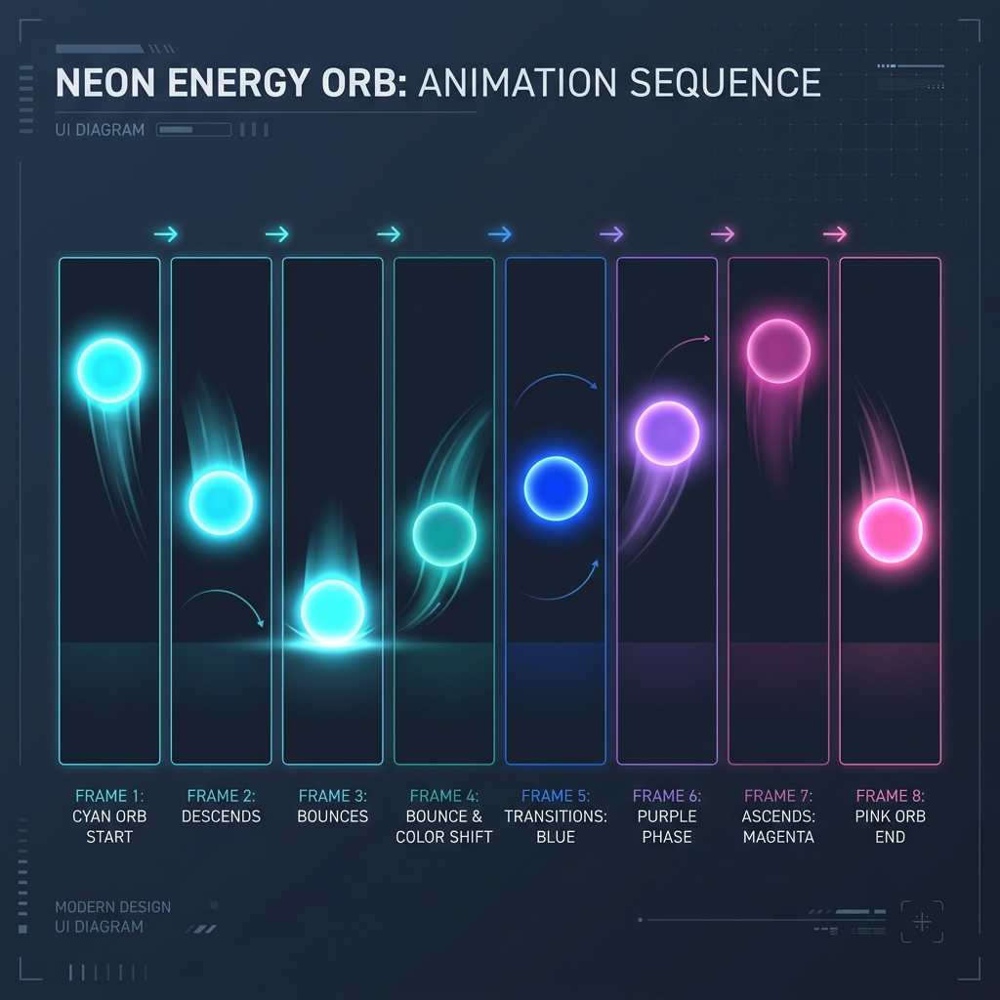

# png_series_animator

A premium, highly customizable Flutter widget that animates a series of PNG images as a high-performance frame-by-frame animation, with built-in support for custom transition builders between frames.

It works like a programmatic flipbook but adds smooth interpolations, crossfades, slides, zooms, and custom effects between frame boundaries.

---

## Showcase Animation Sequence

Below is a conceptual layout of the programmatically generated bouncing energy orb animation sequence featured in the example application:



---

## Features

- ⚡ **High Performance Caching**: Automatically pre-caches and registers all image providers to prevent flickering during playback.
- 🔄 **Looping Controls**: Easily toggle between single playback (`repeat: false`) and infinite looping (`repeat: true`).
- 🛠️ **Custom Transitions**: Build complex inter-frame transitions (e.g. crossfading, sliding, rotating, zooming) using the dynamic `PngSeriesTransitionBuilder`.
- 📊 **Flexible Sizing**: Define layout dimensions using `width`, `height`, and `fit` (supports all standard `BoxFit` types).
- 🔔 **Completion Hook**: Trigger events when non-repeating animations reach their final frame.
- 🎯 **Gapless Playback**: Employs Flutter's gapless playback configuration to prevent frame flashes.

---

## Getting Started

Add the package dependency to your `pubspec.yaml`:

```yaml
dependencies:
  png_series_animator: ^1.0.1
```

Define your animation assets folder in your project's `pubspec.yaml`:

```yaml
flutter:
  assets:
    - assets/your_animation_folder/
```

---

## Usage

Here is a simple example of using `PngSeriesAnimator` in your project:

```dart
import 'package:flutter/material.dart';
import 'package:png_series_animator/png_series_animator.dart';

void main() => runApp(const MyApp());

class MyApp extends StatelessWidget {
  const MyApp({super.key});

  @override
  Widget build(BuildContext context) {
    return MaterialApp(
      home: Scaffold(
        backgroundColor: const Color(0xFF0F172A),
        body: Center(
          child: PngSeriesAnimator(
            imagePaths: List.generate(
              18,
              (index) => 'assets/animation/${10001 + index}.png',
            ),
            duration: const Duration(milliseconds: 1500),
            repeat: true,
            isPlaying: true,
            fit: BoxFit.contain,
            width: 300,
            height: 300,
          ),
        ),
      ),
    );
  }
}
```

### Adding Custom Transitions

By default, the animator performs a flipbook-style step transition. You can supply a `transitionBuilder` to blend consecutive frames together.

For example, to crossfade frames at the boundary of each step:

```dart
PngSeriesAnimator(
  imagePaths: myImagePaths,
  transitionBuilder: (context, currentFrame, nextFrame, progress) {
    // Cross-fade frames during the last 15% of each frame's duration
    double nextOpacity = 0.0;
    const double transitionWindow = 0.15;
    if (progress > (1.0 - transitionWindow)) {
      nextOpacity = (progress - (1.0 - transitionWindow)) / transitionWindow;
    }
    return Stack(
      fit: StackFit.passthrough,
      children: [
        currentFrame,
        if (nextOpacity > 0.0)
          Opacity(
            opacity: nextOpacity,
            child: nextFrame,
          ),
      ],
    );
  },
)
```

---

## Example App

Check the `/example` directory for a full, premium showcase application that includes 6 different custom transition styles:
1. **Quick Crossfade**
2. **Ghost Trail**
3. **Horizontal Slide**
4. **Vertical Slide**
5. **Scale Zoom**
6. **Spin Flip**
7. **Blur Dissolve**

---

## Contact & Support

For questions, issues, or suggestions, feel free to reach out:
- **GitHub**: [amirr-dotcom](https://github.com/amirr-dotcom)
- **Email**: shaizeeabbas.sa@gmail.com

